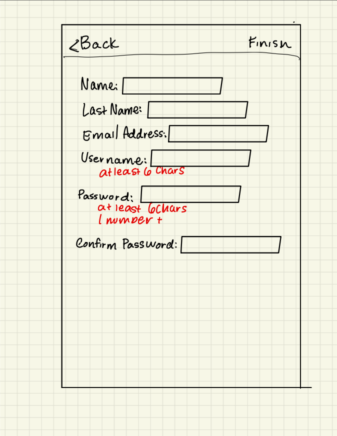

# Product requirements document (PRD)

> ## *chaintune*

### What is Your App Vision Statement?
> A vision statement defines a clear direction towards the end goal of the mobile app.
Chaintune is designed to help people stay focused on a task rather than their mobile devices. The app will contain a timed session that can be used individually or with a group. There will be a point reward system that will construct a leaderboard between friends, encouraging more focus with a sprinkle of competition.

### Create a List of Features
> The first version of your mobile app needs to offer a simple and intuitive user experience. Choosing features for your mobile app is a planning process that requires you to define the product vision, objectives, and themes fully. Some standard features can include:
> * Sign-up and login
> * Splash screen
> * Navigation
> * Forms
> * Social media integration
> * Timed Sessions
> * Multi-user Sessions
> * Leaderboards
> * User Stats

### What is Your Monetization Model? 
> There are several monetization strategies worth exploring. The strategy you choose will depend on the type of app you’re developing and your target user. Conventional monetization models include advertising, pay per download, in-app purchases, freemium, and subscriptions.
>

### Product & Technical Specifications
> Product and technical specifications outline the systemic and functional needs to meet for the product to achieve the desired features and functionalities.
>
> iOS
> Firebase

> Determine the following within the product/technical specifications for your mobile app requirements document:
> * What operating system versions should support it?
> * What are your current services, servers, databases?
> * Do you have current API/services documentation?
> * Do you have current Apple, Google, or other developer accounts/credentials?
> * Are there other credentials that are needed or already exist (analytics systems, or platforms)?

### Dependencies
> Dependencies are any aspect that the product or product team relies on to meet objectives.
> These may include:
>
> Google Sign-in
> Leaderboard API
> Social Media Sharing
> * Hardware that the app will run on/communicate with (for example, beacons)
> * Service/API documentation
> * Profile/account/platform credentials
> * Any third-party software your app relies on
> * Any flowcharts, documents, or information related to the product

### Milestones
> Features Desgin
> App Layout Design
> Backend Functionality
> Polish Front-End

### Wireframes
>App index

  

> Sign-in

  
> Sign-up

  
> Home

  
> User-Stats

  
> Create-Group

  
> Leaderboard

  
